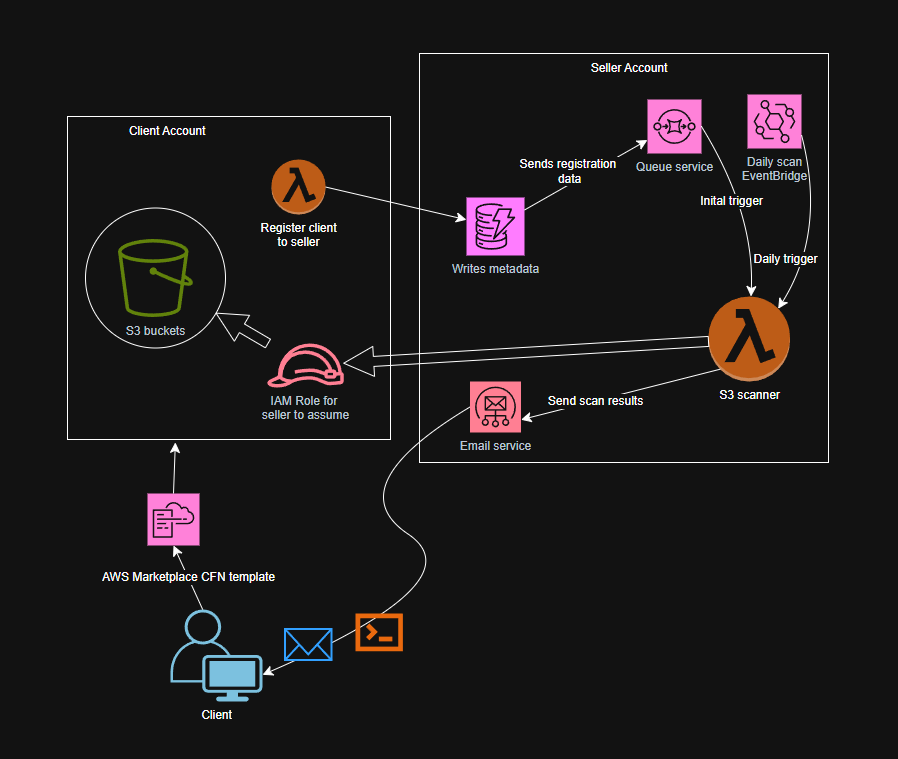

# S3 Security Scanner

## Overview
The S3 Security Scanner is a serverless AWS Lambda function designed to detect and optionally remediate misconfigurations in Amazon S3 buckets within a single AWS account. This tool helps solo developers and small teams ensure their S3 buckets are secure by identifying issues such as public access, wildcard policies, and lack of encryption, providing actionable insights via JSON output.

## Architecture Diagram


The architecture consists of the following components:
- **Lambda**: The core function that scans S3 buckets and applies fixes if configured.
- **EventBridge (cron job)**: Triggers the Lambda function on a scheduled basis (e.g., daily).
- **S3 API call**: The Lambda function interacts with the S3 service to check and update bucket configurations.
- **SES (alerting)**: Sends email notifications based on the scan results (to be implemented in future versions).

## Features
- Scans all S3 buckets in the account for misconfigurations.
- Detects:
  - Disabled Public Access Block settings.
  - Public ACLs granting access to `AllUsers` or `AuthenticatedUsers`.
  - Wildcard (`*`) principals in bucket policies.
  - Lack of default server-side encryption.
- Outputs detailed JSON results summarizing risks per bucket.
- Optional remediation via a `remediate` flag to fix identified issues safely.
- Configurable exclusions for specific buckets.

## Getting Started
### Prerequisites
- AWS account with appropriate IAM permissions.
- AWS CLI configured locally.
- Python 3.8+ environment.
- Git installed for version control.

### Installation
1. Clone the repository:
   ```bash
   git clone https://github.com/Judewakim/s3-security-scanner.git
   cd s3-security-scanner
   ```
2. Install dependencies:
   ```bash
   pip install -r requirements.txt
   ```
3. Deploy the Lambda function using the provided CloudFormation template:
   ```bash
   aws cloudformation deploy --template-file template.yaml --stack-name s3-security-scanner --capabilities CAPABILITY_NAMED_IAM
   ```

### Usage
- Trigger the Lambda function manually via AWS CLI:
  ```bash
  aws lambda invoke --function-name s3-security-scanner --payload '{"remediate": true}' output.json
  ```
- Check the output file `output.json` for scan results.

### Configuration
- Customize the scan by passing a `config` object in the event payload, e.g.:
  ```json
  {
    "config": {
      "exclude_buckets": ["logs-bucket"]
    },
    "remediate": false
  }
  ```

## Development
- **Code**: Written in Python using Boto3 for AWS interactions.
- **Version Control**: Managed with Git; commit often with descriptive messages.
- **Testing**: Test locally with AWS CLI and in a sandbox AWS environment with misconfigured buckets.

## Roadmap
- **v1.0**: Initial release with basic scanning and remediation.
- **v1.1**: Add email alerts via SES, support for multi-account scanning.
- **v2.0**: Integrate ML for risk scoring, enhance UI with a simple dashboard.

## Contributing
Feel free to fork this repository, submit issues, or pull requests. Documentation and code contributions are welcome!

## License
[MIT License] - See the LICENSE file for details.

## Contact
For questions or feedback, reach out via the GitHub Issues page or [Linkedin](https://www.linkedin.com/in/jude-wakim).
