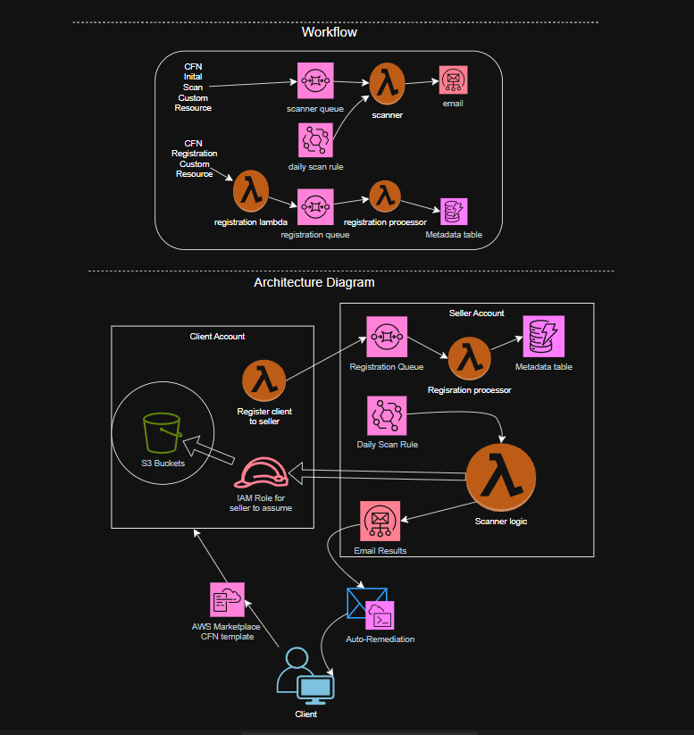

# WakimWorks S3 Security Scanner

WakimWorks S3 Security Scanner is a serverless AWS solution for scanning S3 buckets for misconfigurations across AWS accounts, available via the AWS Marketplace. It identifies security risks (e.g., public access, missing encryption, etc.) and optionally remediates them, delivering results via email. Built with AWS best practices, it uses secure cross-account scanning with STS assume-role.


## Architecture
The solution uses a seller-client architecture:

- **Client Account:** Grants access to S3 buckets for scanning via an IAM role.
- **Seller Account:** Hosts scanning logic, client metadata, and email notifications.




## Installation

#### Deploy Client Stack
Deploy `client-template.yaml` in the client account:  <br> ```aws cloudformation deploy --stack-name S3ScannerClient --template-file client-template.yaml --region us-east-1 --capabilities CAPABILITY_NAMED_IAM --parameter-overrides UserEmail=your-test-email@example.com ExcludeBuckets=test-bucket InvocationMode=scanning_only```

#### Parameters:
**UserEmail:** Email for scan results. <br>
**ExcludeBuckets:** Comma-separated list of buckets to skip (e.g., test-bucket,test-bucket-2). <br>
**InvocationMode:** scanning_only or scanning_and_autoremediation.


## Usage

#### Automatic Scan:
Deploying the client stack triggers an immediate scan via SQS (S3ScannerRegistrationQueue).
Check the client email for results.

#### Daily Scan:
EventBridge (DailyScanRule) triggers scans daily at 10 PM EDT.

#### Manual Testing:
Invoke the scanner Lambda: <br> `aws lambda invoke --function-name S3SecurityScanner --payload "eyJtb2RlIjogImRhaWx5X3NjYW4ifQ==" response.json --region us-east-1` <br><br>
`cat response.json`


## Security Considerations

#### IAM Roles:
**S3SecurityScannerLambdaRole (seller):** Grants DynamoDB, STS, SES, and SQS permissions. <br>
**S3SecurityScannerClientRole (client):** Allows S3 access with STS ExternalId for security.

#### SQS Policy: 
Restricts `sqs:SendMessage` to the client account for least privilege.

#### STS ExternalId: 
Unique per client, preventing confused deputy attacks.


## Troubleshooting & Support
**Email:** judewakim@wakimworks.com <br>
**Website:** https://www.wakimworks.com 


## License
MIT License. <br>
Contributing <br>
Contributions are welcome! Submit issues or pull requests to https://www.github.com/judewakim/s3-misconfig.